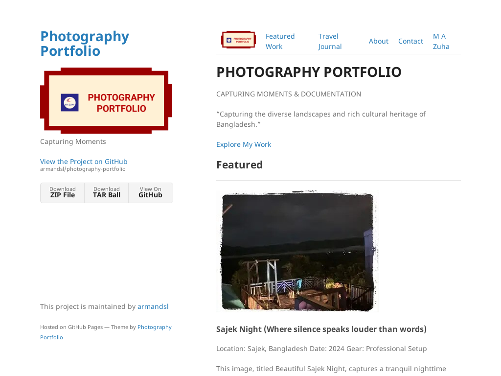

# Photography Portfolio

*Minimal is a Jekyll theme for GitHub Pages. You can [preview after applying this theme what it looks like](https://armandsl.github.io/photography-portfolio).*


Please follow the instructions below to use the repository:
## Table of Contents
- [Introduction](#introduction)
- [Features](#features)
- [Installation](#installation)
- [Usage](#usage)
- [Contributing](#contributing)
- [License](#license)
- [Contact](#contact)

## Introduction
This site is used Minimal Jekyll theme for GitHub Pages. Help us make these docs or pages great!

## Features
- **Explore My Work**: Featured Professional Work.

## Installation
To get started with the Photography Portfolio, follow these steps:

1. **Clone the repository**:
   ```bash
   git clone https://github.com/armandsl/photography-portfolio.git
   ```

2. **Navigate to the project directory**:
   ```bash
   cd photography-portfolio
   ```

3. **Install dependencies**:
   ```bash
   npm install
   ```

4. **Run the project**:
   ```bash
   npm start
   ```

## Usage
Photography Portfolio site is used jekyll-theme-minimal for GitHub Pages.
To use the jekyll-theme-minimal, follow these steps:

1. Add the following to your site's `_config.yml`:

```
title: Photography Portfolio
description: Capturing Moments 
logo: /assets/img/logo.png
show_downloads: true
google_analytics:
theme: jekyll-theme-minimal
```

2. Create Stylesheet

```
Create a file called `/assets/css/style.scss` in your site
Add the following content to the top of the file, exactly as shown: 
---
---

@import "{{ site.theme }}";
```

3. Create js file
```
Create a file called `/assets/js/scale.fix.js
Add the following content to the top of the file, exactly as shown:

(function(document) {
    var metas = document.getElementsByTagName('meta'),
        changeViewportContent = function(content) {
            for (var i = 0; i < metas.length; i++) {
                if (metas[i].name == "viewport") {
                    metas[i].content = content;
                }
            }
        },
        initialize = function() {
            changeViewportContent("width=device-width, minimum-scale=1.0, maximum-scale=1.0");
        },
        gestureStart = function() {
            changeViewportContent("width=device-width, minimum-scale=0.25, maximum-scale=1.6");
        },
        gestureEnd = function() {
            initialize();
        };
    if (navigator.userAgent.match(/iPhone/i)) {
        initialize();
        document.addEventListener("touchstart", gestureStart, false);
        document.addEventListener("touchend", gestureEnd, false);
    }
})(document);
```

4. Templates often rely on URLs supplied by GitHub such as links to your repository or links to download your project.
```
Look at [the template source](https://github.com/armandsl/photography-portfolio/blob/main/_layouts/default.html) to determine the name of the variable. It will be in the form of `{{ site.github.zip_url }}to determine the name of the variable. It will be in the form of `{{ site.github.zip_url }}`.

Specify the URL that you'd like the template to use in your site's `_config.yml`. For example, if the variable was `site.github.url`, you'd add the following:

github:
  [Download](https://github.com/armandsl/photography-portfolio/zipball/main)
```

## Contributing
We welcome contributions from the community! To contribute:

1. Fork the repository.
2. Create a new branch: `git checkout -b my-feature-branch`.
3. Make your changes and commit them: `git commit -m 'Add some feature'`.
4. Push to the branch: `git push origin my-feature-branch`.
5. Submit a pull request.

Please ensure your code follows our [coding standards](link-to-coding-standards) and [contribution guidelines](link-to-contribution-guidelines).

## License
This project is licensed under the [MIT License](LICENSE).

## Contact
For any questions, feel free to [reach out to the team](mailto:contact@portfolio.zuha.site).
